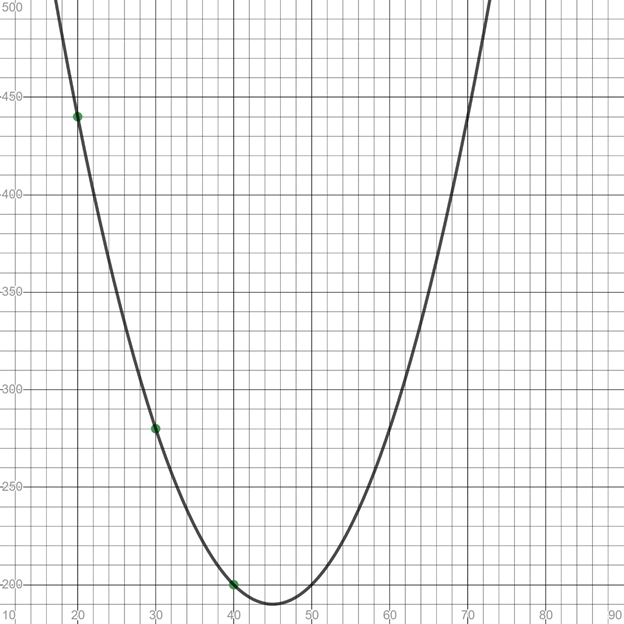
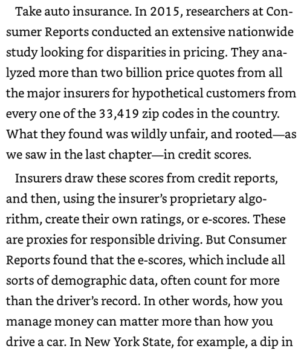
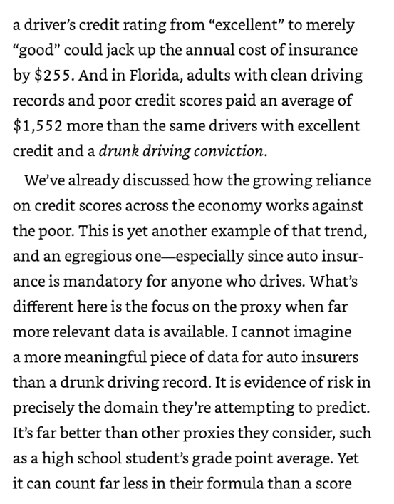
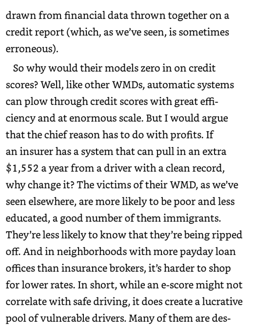

# Title: Ethical Considerations of Automobile Insurance Premiums
Designed by: Patrick Farrell, Phillips Academy Andover

## Synopsis
The lesson begins with a data set of the number of accidents per million kilometers driven based on one’s age. Students, working in small groups, are asked to use this data to write pseudocode that inputs age and outputs cost of car insurance. The second part of the lesson asks them to read an excerpt from Weapons of Math Destruction by Cathy O’Neil that details how car insurance premiums are actually determined. Part three of the lesson involves student inquiry into the ethics of how car insurance is priced.

I highly recommend Cathy O’Neil’s book as it is a healthy reminder that teaching a young person computer science or mathematics devoid of consideration of ethical consequences is fraught with danger. I was inspired to do this particular example by a summer I spent doing actuarial work. After a month of developing a fair pricing plan for a new product, the chief actuary came by to look at my work. He spent under two minutes looking at pages of calculations and then said, “Impressive mathematics. Let’s raise the price by $50.00 per month for this group of people - they have enough money to afford it but are not sophisticated enough to question the price.”

## Context
This lesson is designed for use in an introductory computer science class. In terms of programming skill, students should be familiar with requesting user input, using conditional (if-else) statements and producing outputs. As such, it can be introduced after those topics are covered in the opening days of the course.

## Learning Objectives
Students will be able to write quality pseudocode for a real world application of conditional (if-else) statements. In addition, students will be able to explore the ethical consequences of decision making and see how computer scientists can pose questions regarding the ethics of their work before beginning to code.

## Assessment
Students will submit pseudocode via a learning management system. In addition, one scribe from each group will submit a summary of the group’s ethical decision making discussion.

# Detailed Plan (handout for students)

## Part I: Writing Pseudocode to Determine Car Insurance Premium

### Background
The graph below represents age on the x-axis and accidents per 100 million kilometers driven on the y-axis. For example, an average 20-year-old driver would expect to be involved in 440 accidents if they drove 100 million kilometers.

You may be thinking that no 20-year-old could possibly drive 100 million kilometers in a year. So why are these numbers so big? If you sample a very small number of drivers at age 20, you run the risk that your sample does not reflect the overall experience of drivers age 20. One of the big advantages of using computers is that they can easily handle large databases that a human being would find daunting.

### Activity
Let’s see if we can write some pseudocode for determining a yearly premium. Assume that the actuaries (people who compile and analyze statistics and use them to calculate insurance risks and premiums) have already done some of the groundwork for you. They determined that the safest drivers on the road should pay $1000 per year and that 16-year-old and 74-year-old drivers should pay twice that amount. Write pseudocode that will input age and output the corresponding yearly premium for that input. Please don’t spend a lot of time being mathematically precise. It will suffice to use a single dollar amount added on to the lowest premium for each year above (or below as the graph is symmetric) age 45.

_(Note to readers of this lesson plan — in effect, this implements a linear model while the pictured graph is quadratic. If you desire a more mathematically appropriate model, it is easy enough to find a quadratic model using three data points. I recommend two days for the lesson if you take this approach.)_

### Discussion

1. This is a data-driven, computer analyzed approach to setting a price for car insurance. As such, we may think that we have removed the potential bias and prejudice that a human being doing this work might unknowingly bring to the job. Do you see any unfairness with this approach or potential for problems? If not, can you briefly justify why you feel this is a reasonable approach?
2. Are there ways that we could improve this model? What other information might you seek about an individual applying for driver insurance? Your group should agree on two additional pieces of data that you’ll collect on each applicant. Imagine you are working for an insurance company that has an internal ethics review board. Knowing that your work will be viewed from this perspective, for each of these pieces of data, identify potential problems or unfairness or argue that using said data is a reasonable way to determine the price of car insurance.

## Part II: An excerpt from Weapons of Math Destruction (WMD) by Cathy O’Neil

### Reflection
Take several minutes to reflect on this piece. What emotions did you experience while you read this selection? Where does Prof O'Neil's argumentation conflict with your assertions above/before? (Being cognizant of one’s emotions can help support meaningful conversation around challenging topics.)

It is challenging to confront facts or opinions that cause us to rethink our views. For this discussion, let’s practice deep listening. If you find yourself in general agreement with Dr. O’Neil’s points, prepare to present a counter argument. In similar fashion, if you generally disagree with the author’s perspective, prepare a defense of one or more of her key points.

### Discussion
Each member of the group has up to two minutes to present their case argument/counter argument. After everyone has taken their turn, go around the circle one more time allowing each participant to ask one question to another student in regard to their argument (or counter argument as the case may be).

* **Assessment Part I**: Please submit your pseudocode for car insurance pricing
* **Assessment Part II**: Please submit a summary of your group’s discussion around the ethics of determining premiums for car insurance. How do we plan for a better future? What systems might we put in place to ensure that we do not fall prey to the pitfalls suggested by Professor O’Neil?

 This work is licensed under a <a rel="license" href="http://creativecommons.org/licenses/by-nc-sa/4.0/">Creative Commons Attribution-NonCommercial-ShareAlike 4.0 International License</a>
